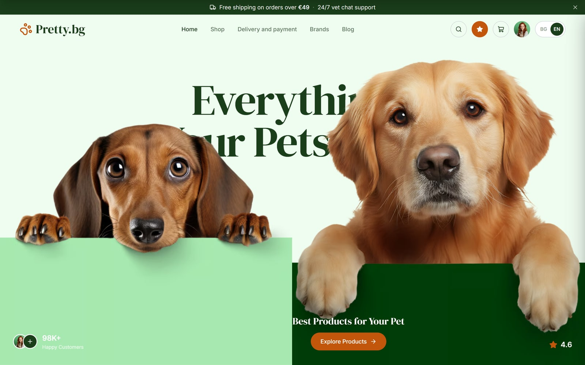
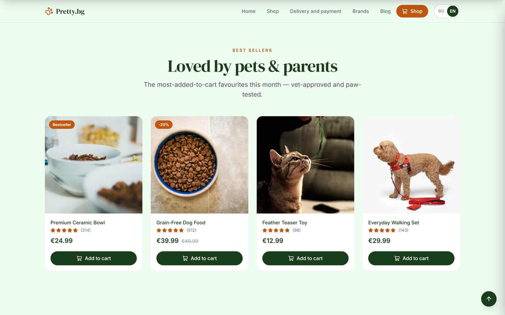

<div align="center">

# 🐾 Pretty.bg

### Everything your pets love — a modern, fully **bilingual** pet‑shop landing page.

A polished, production‑style storefront built with **React 19**, **TypeScript**, **Vite** and **Tailwind CSS** — featuring an animated hero, client‑side cart & wishlist, instant **BG 🇧🇬 / EN 🇬🇧** switching and localized € pricing.

<br/>


<br/>



</div>

---

## ✨ Highlights

- 🌍 **True bilingualism (BG / EN)** — a type‑safe i18n dictionary as the single source of truth. The choice is remembered (`localStorage`), auto‑detected from the browser on first visit, and kept in sync with `<html lang>` and the document title. Every string, `aria-label` and image `alt` is translated.
- 💶 **Localized euro pricing** — formatted per locale via `Intl.NumberFormat` (EN `€24.99`, BG `24,99 €`).
- 🎬 **Animated hero** — recreated pixel‑for‑pixel, with word‑by‑word title reveals, photo reveals and a smooth `0 → 98K+` count‑up (respecting `prefers-reduced-motion`).
- 🛒 **Client‑side cart & wishlist** — React Context state, off‑canvas drawers, a free‑shipping progress bar, quantity steppers and thoughtful empty states.
- 🔍 **Modern commerce UX** — command‑palette style search overlay (`⌘/Ctrl + K` or `/`), account menu, a condensed sticky nav on scroll, and a full‑screen mobile menu.
- 📱 **Responsive & accessible** — mobile‑first from 320 px up, three dedicated hero layouts, focus‑visible rings, skip link, semantic landmarks and reduced‑motion support.
- ⚡ **Performance‑minded** — lazy images with intrinsic dimensions (no layout shift), `100svh` hero, and optimized in‑repo photography.

<div align="center">
  
</div>

---

## 🧰 Tech Stack

| Layer | Technology |
| --- | --- |
| **Framework** | [React 19](https://react.dev) |
| **Language** | [TypeScript](https://www.typescriptlang.org) |
| **Build tool** | [Vite 8](https://vite.dev) |
| **Styling** | [Tailwind CSS 3](https://tailwindcss.com) |
| **Icons** | [lucide-react](https://lucide.dev) |
| **Linting** | [oxlint](https://oxc.rs) |
| **State** | React Context (cart, wishlist, i18n) |

> No backend required — this is a front‑end showcase. Cart, wishlist and search run entirely client‑side.

---

## 🚀 Getting Started

**Prerequisites:** [Node.js](https://nodejs.org) 18+ and npm.

```bash
# 1. Clone the repository
git clone https://github.com/Niko5886/Pretty.bg.git
cd Pretty.bg

# 2. Install dependencies
npm install

# 3. Start the dev server (http://localhost:5173)
npm run dev
```

### Available scripts

| Command | Description |
| --- | --- |
| `npm run dev` | Start the Vite dev server with HMR |
| `npm run build` | Type‑check and build for production (`dist/`) |
| `npm run preview` | Preview the production build locally |
| `npm run lint` | Lint the codebase with oxlint |

> **Deploy‑ready** for [Vercel](https://vercel.com) or [Netlify](https://www.netlify.com) — build with `npm run build` and serve `dist/`.

---

## 📁 Project Structure

```
src/
├── components/
│   ├── sections/        # Announcement, Benefits, Categories, BestSellers,
│   │                    #   BrandStory, WhyPretty, Testimonials, Newsletter, Footer
│   ├── ui/              # Reusable primitives (Button, Drawer, ProductCard,
│   │                    #   CountUp, StarRating, LanguageSwitcher, …)
│   ├── Header.tsx       # Nav + search / wishlist / cart / account / language
│   ├── Hero.tsx         # Three responsive hero layouts (desktop / tablet / mobile)
│   ├── CartDrawer.tsx   # Off-canvas cart with free-shipping progress
│   ├── WishlistDrawer.tsx
│   ├── SearchOverlay.tsx
│   └── …
├── context/
│   └── ShopContext.tsx  # Cart, wishlist & UI panel state
├── i18n/
│   ├── translations.ts  # BG / EN dictionary — single source of truth
│   ├── I18nContext.tsx  # useI18n() hook, persistence, <html lang> sync
│   └── format.ts        # Locale-aware euro formatting
├── data/                # Structural data (products, categories, nav, testimonials)
├── hooks/               # useReveal (scroll reveal), useScrolled
└── lib/                 # Shared assets & helpers
```

---

## 🌍 Internationalization

Translations live in a single, type‑checked dictionary (`src/i18n/translations.ts`). The English object is the reference type, so the compiler flags any missing Bulgarian key — no runtime surprises. Components read strings through the `useI18n()` hook:

```tsx
const { t, lang, setLang, formatPrice } = useI18n();

t.hero.explore;        // "Explore Products" / "Разгледай продуктите"
formatPrice(24.99);    // "€24.99" / "24,99 €"
```

Structural data (prices, images, ratings) is kept separate from copy, which is keyed by id — so adding a language means editing one file.

---

## 📄 License

Released under the [MIT License](./LICENSE).

Product & lifestyle placeholder imagery is provided by [Unsplash](https://unsplash.com) under the Unsplash License.

---

<div align="center">

### 👤 Author

**Nikolay Stoyanov** · AI‑native Full‑Stack Developer

[](https://github.com/Niko5886)
[](https://www.linkedin.com/in/nikolay-stoyanov-dev)

<sub>If you like this project, consider giving it a ⭐</sub>

</div>
